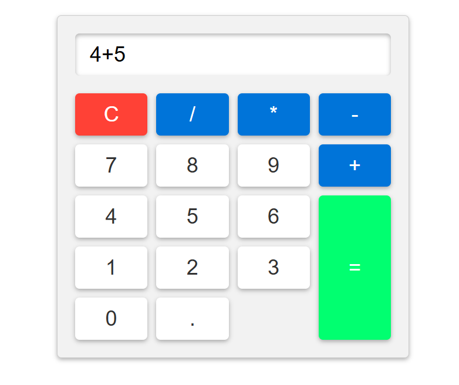

# Basic Calculator

A **web-based calculator** built with HTML, CSS, and JavaScript. This simple calculator supports basic arithmetic operations including addition, subtraction, multiplication, division, and decimal calculations.

---

## Demo

Here’s how the calculator looks:



---

## Features

- Perform basic arithmetic operations: `+`, `-`, `*`, `/`.  
- Supports decimal numbers.  
- Clear button (`C`) to reset the input.  
- Responsive design suitable for desktop and mobile.  
- Interactive buttons with hover effects for better UX.

---

## Technologies Used

- HTML5  
- CSS3  
- JavaScript (ES6)

---

## How It Works

1. User clicks on number buttons to enter values.  
2. Click operator buttons (`+`, `-`, `*`, `/`) to perform operations.  
3. Press the `=` button to calculate the result.  
4. Click `C` to clear the input and start over.  

The result is displayed dynamically in the input field at the top of the calculator.

---

## Installation

1. Clone the repository:
```bash
git clone https://github.com/Ritupagar12/basic-calculator.git
```
2. Navigate to the project folder:
```bash
cd simple-calculator
```
3. Open index.html in your browser.
